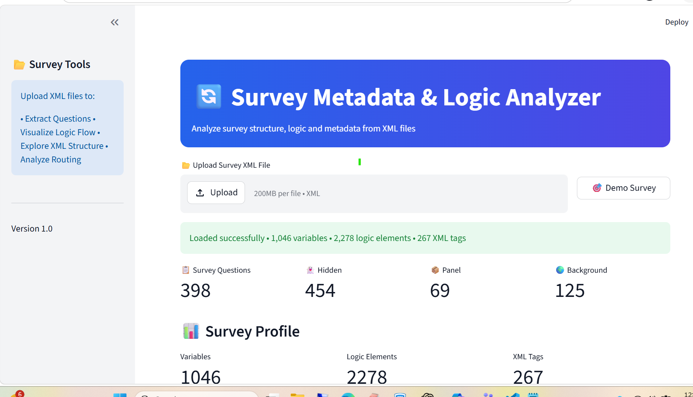
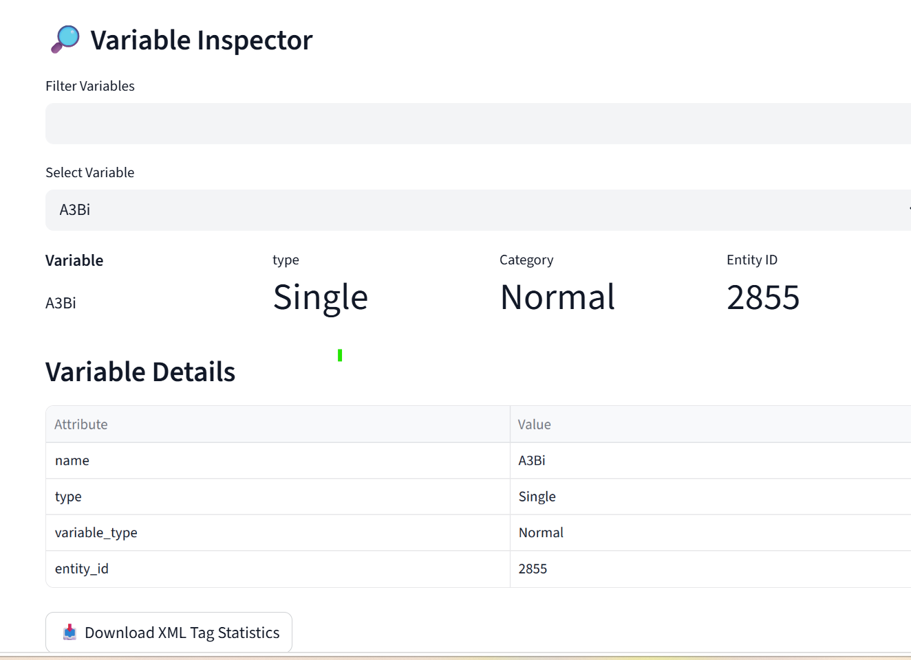
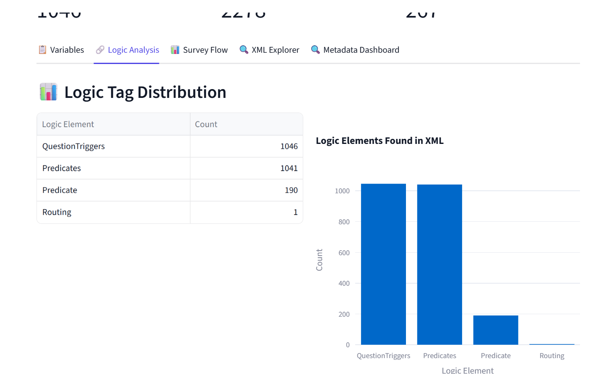
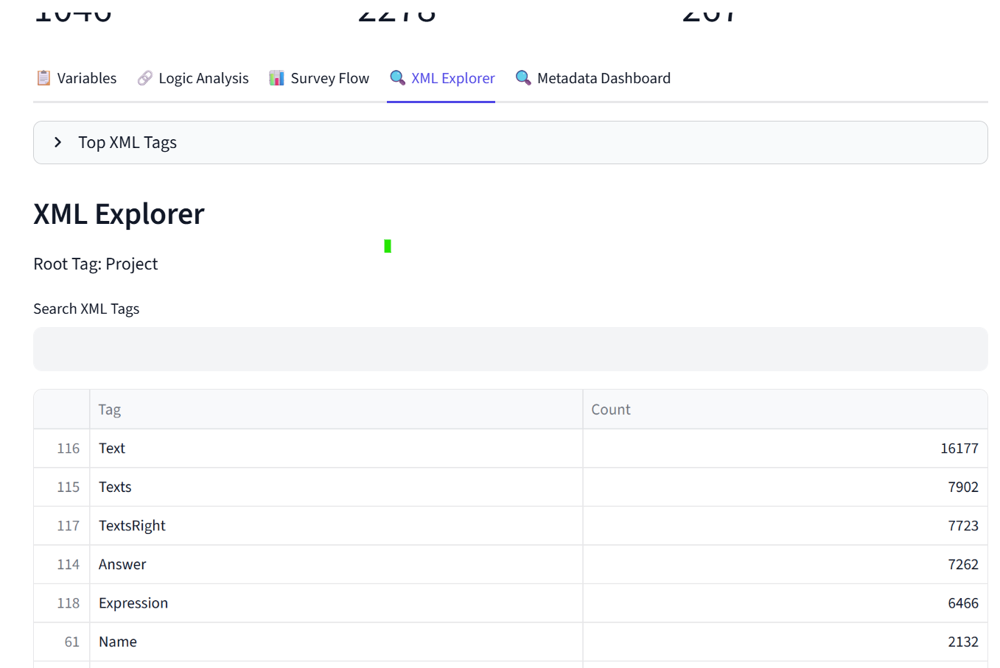

# Survey Metadata & Logic Analyzer

A professional Streamlit application for analyzing, validating, and visualizing survey XML files used in market research, social research, and enterprise survey platforms.

## Overview

Survey XML files often contain hundreds or thousands of variables, routing conditions, validation rules, and metadata definitions. Manually reviewing these files can be time-consuming and error-prone.

Survey Metadata & Logic Analyzer provides an interactive interface to explore survey structures, inspect metadata, analyze routing logic, and visualize survey flow without manually navigating raw XML.

---

## Key Features

### Variable Explorer

* Extract variables from survey XML files
* Search and filter variables instantly
* Review variable metadata
* Export results to CSV or Excel

### Variable Inspector

* View detailed variable attributes
* Inspect question types and categories
* Review entity identifiers
* Explore variable-level metadata

### Logic Analysis

* Extract routing and logic components
* Analyze logic distribution
* Review survey branching behavior
* Export logic reports

### Survey Flow Visualization

* Interactive survey flow diagrams
* Question sequence visualization
* Routing structure overview
* Large-survey support

### XML Explorer

* XML tag statistics
* XML structure analysis
* Search XML elements
* Preview XML content

### Metadata Dashboard

* Survey profile summary
* Variable statistics
* Logic statistics
* Question type distribution
* Validation summary

### Validation Checks

* Duplicate variable detection
* Missing variable identification
* Missing entity detection
* XML structure validation

---

## Technology Stack

* Python
* Streamlit
* Pandas
* Plotly
* Graphviz
* XML Processing Libraries

---

## Project Structure

survey_logic_visualizer/

├── app.py

├── parsers/

│ ├── xml_parser.py

│ ├── question_extractor.py

│ └── logic_extractor.py

├── visualizers/

│ └── graph_builder.py

├── services/

│ └── excel_exporter.py

├── sample_files/

├── requirements.txt

└── .streamlit/

    └── config.toml

---

## Installation

```bash
git clone https://github.com/<your-username>/survey-metadata-logic-analyzer.git

cd survey-metadata-logic-analyzer

pip install -r requirements.txt

streamlit run app.py
```

---

## Usage

1. Launch the application
2. Upload a survey XML file
3. Explore survey metadata
4. Analyze routing logic
5. Visualize survey structure
6. Export analysis results

---

## Business Value

This tool helps survey teams:

* Reduce survey review time
* Improve survey documentation
* Validate survey structure efficiently
* Analyze routing logic visually
* Accelerate survey migration projects
* Support metadata auditing activities

---

## Future Enhancements

* Advanced routing visualizations
* Survey impact analysis
* Automated documentation generation
* Multi-file survey comparison
* Enhanced validation framework

---

## Screenshots

### Metadata Dashboard



### Variable Explorer



### Logic Analysis



### Survey Flow Visualization


### XML Explorer



---

## Author

Developed using Python and Streamlit as a survey analytics and metadata exploration solution.
